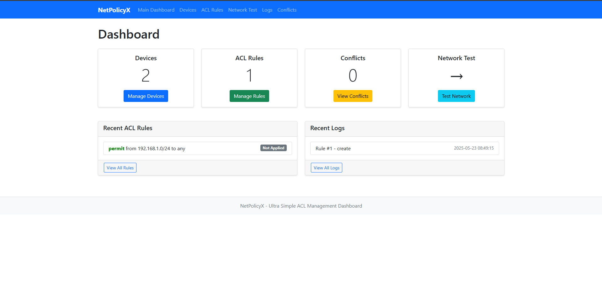
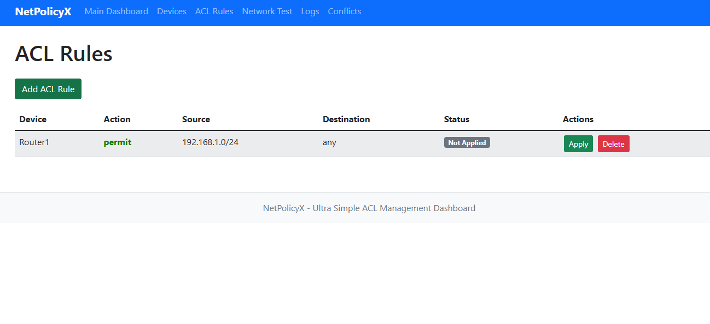
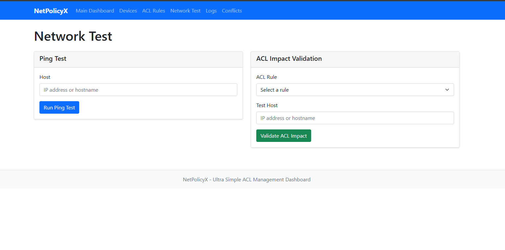

# 🔧 NetPolicyX-ACLManager

A lightweight, beginner-friendly Flask application to simulate ACL (Access Control List) management across network devices. Designed for learning, demoing, and understanding core networking concepts—without needing real hardware.

---

## 🌟 Features

- 🔌 Add and manage network devices
- 🧾 Create and simulate ACL rules
- ⚠️ Detect conflicts between rules
- 🧪 Test connectivity and simulate ACL impacts
- 📜 View operation history logs
- 🧑‍💻 Fully simulated—no real network devices needed

---

## ⚙️ Installation

### ✅ Requirements
- Python 3.6+
- Flask

### 📦 Setup

1. Extract the project files
2. Navigate to the project folder:
   ```bash
   cd NetPolicyX-ACLManager
   ```
3. Install Flask:
   ```bash
   pip install flask
   ```
4. Run the app:
   ```bash
   python app.py
   ```
5. Open [http://localhost:5000](http://localhost:5000) in your browser

---

## 🚀 Usage Guide

### 🖥️ Managing Devices
- Go to the **Devices** page
- Click **Add Device**
- Provide device name and IP
- Click **Test Connection** to simulate ping

### 🛡️ Creating ACL Rules
- Go to **ACL Rules**
- Click **Add ACL Rule**
- Select a device, action (permit/deny), and address ranges
- Click **Save Rule**

### ⚙️ Applying/Removing Rules
- Use **Apply** or **Remove** on each rule
- Status updates in real-time (simulated)

### ❗ Conflict Detection
- Go to **Conflicts** page
- Review automatically detected rule conflicts

### 🌐 Network Testing
- Navigate to **Network Test**
- Simulate ping or validate impact of specific ACLs

### 📜 Logs
- View operation history in the **Logs** page

---

## 🖼️ Screenshots

### 🔧 Dashboard


### ✅ Rule Creation


### 📬 ACL Validation


---

## 🔁 Simulation Mode Notes

- No real network connections are made
- All interactions (ping, ACL, device status) are simulated
- Perfect for demonstrations or learning environments

---

## 🧪 Sample Test Data

### Sample Device
- **Name**: Router1
- **IP**: 192.168.1.1

### Sample ACL Rules
1. Permit from `192.168.1.0` to `any`
2. Deny from `any` to `10.0.0.1`

### Ping Target
- `8.8.8.8`

---

## 🛠️ Project Structure

```
NetPolicyX-ACLManager/
├── app.py
├── templates/
├── images/
│   ├── dashboard.png
│   ├── rule_form.png
│   └── acl_validation.png
├── netpolicyx.db
├── requirements.txt
```

---

## 🙌 Contributing & Feedback

Want to improve or extend the project?  
Feel free to fork, contribute, or open issues on GitHub.  
Let's make network security education easier for everyone!
